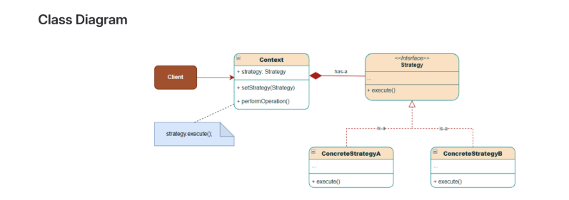

The Strategy pattern is a behavioral design pattern that defines multiple algorithms,
encapsulates their logic in dedicated classes, and enables changing an algorithm's
behavior at runtime. It's particularly useful when you have multiple ways to perform a task
and want to choose the approach dynamically.

Problems without Strategy Pattern
Refer Strategy Pattern | Implementation section below for a better understanding.
1. Massive Conditional Blocks leading to bloated classes
2. Violation of the Open/Closed Principle and Single Responsibility Violation
3. Code Duplication
4. Tight Coupling
5. Testing Complexity

Strategy Interface( PaymentStrategy ): Defines a common interface(contract) that all concrete strategies
must implement.
Concrete Strategies( CreditCardPayment , PayPalPayment , UPIPayment ): Different
implementations of the strategy interface, each representing a specific algorithm or approach.
Context Class( ShoppingCart ): The class that uses a strategy. It maintains a reference to a strategy object
and delegates work to it. Context uses Concrete Strategies to choose the required behavior among the available
family of algorithms at runtime.

